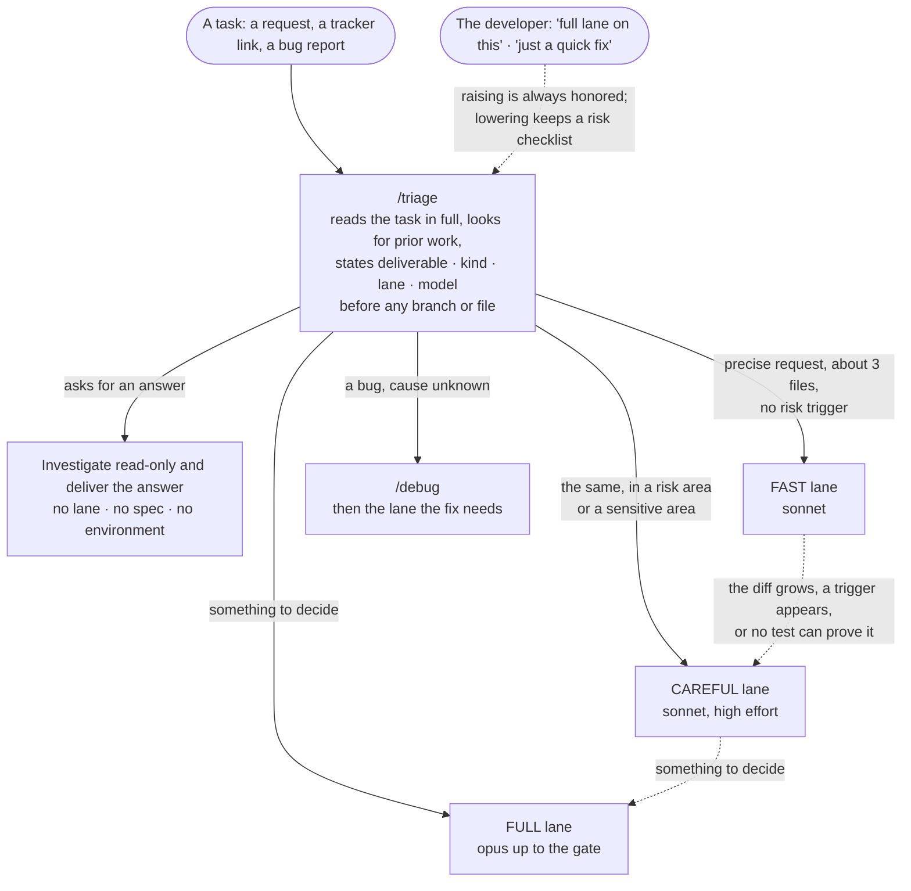
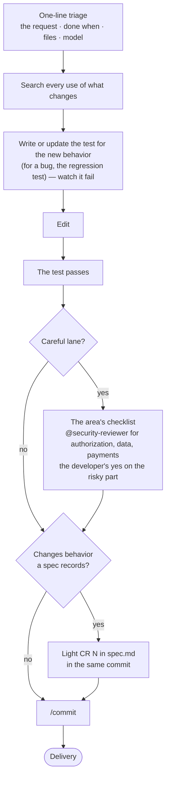
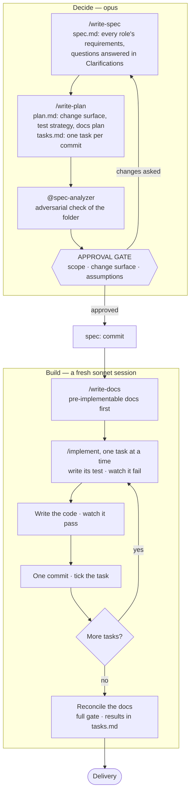
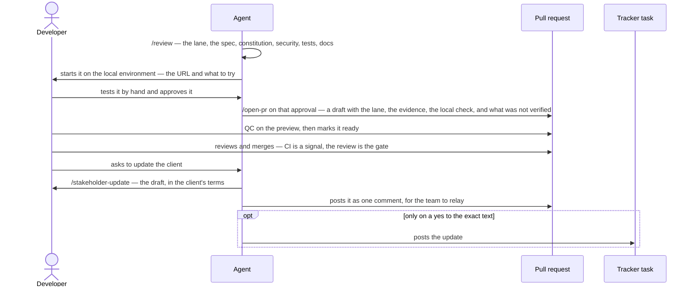
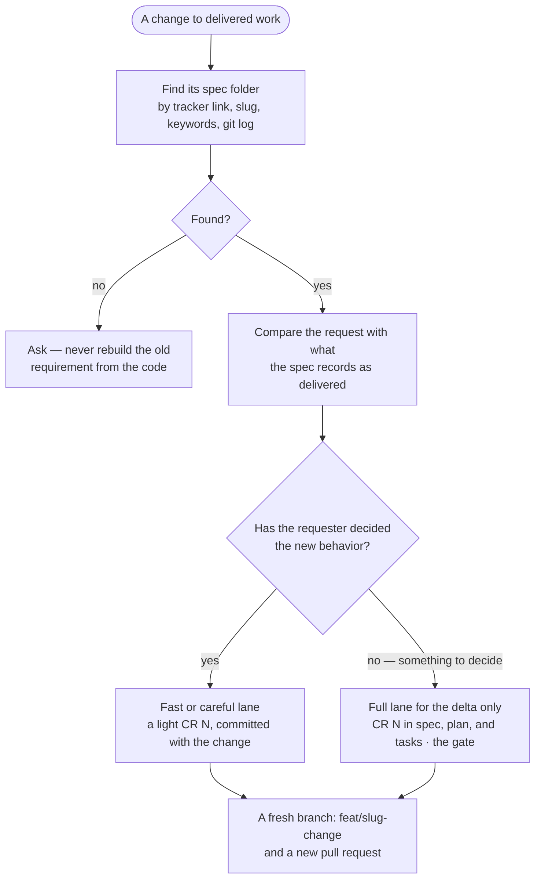
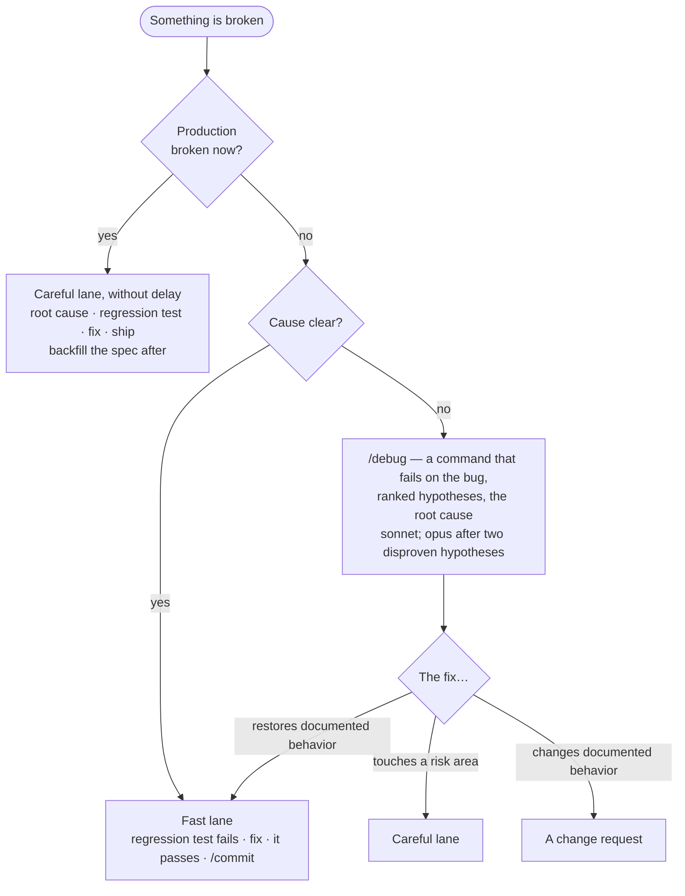

# Agentic Development Framework

> **AI agents:** asked to adopt, use, or install this framework in a project? Follow
> [ADOPT.md](ADOPT.md) (raw: `https://raw.githubusercontent.com/aplyca/AgenticDevelopmentFramework/main/ADOPT.md`)
> — don't copy files from this repository by hand.

A production-grade framework for professional **multi-perspective spec-driven, test-driven, docs-first AI-assisted development.** It ships as a portable project skeleton you drop into any codebase, optional modules for your Git host, your stack, and your ways of working, and an installer plugin for Claude Code. It includes an enforced multi-perspective spec model, specialized agents, workflow skills, multi-agent workflows, and guardrail hooks. Engineering standards and a team onboarding path are part of it too.

The framework is built on three reinforcing disciplines:
- **Multi-perspective spec-driven design** — every feature's spec captures input from all relevant roles (business, functional, security, accessibility, privacy, design, performance, and more), with required sections enforced. The plan that follows names the exact **change surface**, and nothing is implemented until a human approves it.
- **Test-driven development** — every task names the test that proves it; the test is written and **seen failing** before the code that makes it pass, and each task lands as one commit.
- **Docs-first delivery** — user-facing docs (admin guides, API contracts, end-user copy) are written from the spec and plan before implementation, and deliberately updated when reality shifts — living artifacts, never frozen contracts.

How much of that a change gets follows its risk, not its size: a precise fix goes through a fast lane and is proved by a test, and the full spec flow is kept for changes with something to decide. The model follows the work the same way — Sonnet for well-specified work, Opus for judgment.

Works with Claude Code natively; supports Cursor, Antigravity, GitHub Copilot, Codex, Aider, and Windsurf via the [AGENTS.md](https://agents.md) standard.

Most of what's here was proven in real client projects first — some built on this framework, some grown alongside it — and then generalized. The reasoning behind each decision is in [`docs/decisions/`](docs/decisions/README.md).

## What's included

- **Spec folders** — `specs/NNN-<slug>/` with `spec.md` (the multi-perspective WHAT and WHY), `plan.md` (constitution check, change surface, test strategy, documentation plan, assumptions), and `tasks.md` (one task per commit, each naming its test, plus recorded gate results). Change requests amend the same folder. ([Process](skeleton/specs/README.md) · [Spec model](skeleton/docs/SPEC-MODEL.md))
- **Three lanes — ceremony follows risk, not size** — fast (a precise change, proved by a test), careful (a risk area: plus its checklist and the developer's yes), and full (something to decide: the spec-driven flow). `/triage` states the lane before the first edit, the developer can always raise it, and sensitive areas are configuration, enforced by a hook. ([Lanes](skeleton/specs/README.md#lanes--how-much-process-a-change-gets) · [why](docs/decisions/0011-lanes-ceremony-follows-risk.md))
- **The model follows the work** — `sonnet` when the task has a clear spec and a way to check the result (the fast and careful lanes, bug fixes, reviews, implementing an approved plan), `opus` for judgment (the full lane's spec and plan, a bug that resists diagnosis). Version-less aliases throughout; `/triage` names the model, and agents carry their own. ([Choosing a model](skeleton/docs/COST-MODEL.md#choosing-between-sonnet-and-opus) · [why](docs/decisions/0012-choose-the-model-by-the-work.md))
- **One approval gate on the change surface** (full lane) — after the plan, before any code: scope, the files and layers the change touches, and every assumption, signed off by a human.
- **20 workflow skills** — triage, spec, plan, tests, docs, implement, review, commit, draft PR, the stakeholder update, handoff, decision records, context and drift audits, and more — plus `/dispatch` with the `parallel-agents` module and `/dev-env` with `docker`. ([Catalog](docs/SKILLS-REFERENCE.md))
- **8 specialized agents**, each on the model its work needs — reviewers on `sonnet`; `@spec-analyzer` (which adversarially checks a spec folder before the gate) and `@architect` on `opus`. ([Catalog](docs/AGENTS-REFERENCE.md))
- **4 dynamic workflows** — `/deep-review`, `/deep-spec-analysis`, `/deep-context-audit`, `/deep-drift-sweep`: deterministic multi-agent fan-outs where every finding is independently verified.
- **Guardrail hooks and permissions** — the rules that must hold every time are configuration, not prose. The hooks give each session its branch and spec folder, remind the agent once to state the triage before its first edit, stop a fast-lane edit in a sensitive area, keep the main checkout edit-free when it's the hub (parallel-agents), block `--no-verify`, block commits and pushes on protected branches, block hand-edits to lockfiles and existing migrations, and report undeclared env vars. Each push and pull-request action needs a human to confirm it, and `.env` files are never read.
- **9 engineering standards** — code quality (including "write almost no comments"), testing, security, git workflow, plus customizable architecture, UI/UX, deployment, performance, observability.
- **Process records** — a constitution that gates every spec and review, Process Decision Records for how the team works, ADRs for the application, and on-demand code-level reference pages.
- **Optional modules** — `github` (PR template with the lane, traceability, and constitution gates; issue forms, secret scan, base-branch policy), `git-hooks` (tool-agnostic `pre-push`), `clickup` (ClickUp's MCP server, so `/triage` reads tasks directly; a read-only allowlist, and each developer signs in with OAuth), `parallel-agents` (one worktree, branch, and session per task — plus its own port when the app runs locally; the main checkout only dispatches), `docker` (`/dev-env` sets up, diagnoses, and safely resets a Docker Compose local environment, one stack per worktree; destructive docker commands ask first). ([Modules](modules/README.md))
- **The `aplyca-adf` plugin** — `/aplyca-adf:adopt` and `/aplyca-adf:upgrade` for Claude Code, plus `/aplyca-adf:cost-report`: what each agent session on a project cost — calls, context, tokens, estimated cost, and what Opus sessions would have cost on Sonnet — with flags for long context, cache-expiring pauses, and spec-heavy small changes. ([Plugin](plugins/aplyca-adf/README.md)) In a packaged project it also carries the framework's skills, agents, workflows, and hooks, pinned to a release. Beside it, `adf-dev` carries the development skills of the modules a project installs — `/adf-dev:dev-env` with `docker` — and `adf-connect`, for trackers and services, is planned ([why](docs/decisions/0023-plugins-by-concern.md)).
- **Evals** — structural checks plus functional tests of the hooks, module scripts, and plugin, run in CI on every pull request at zero token cost; routing evals that run `/triage` in real Claude Code sessions on Sonnet and Opus, with graded reports. ([Evals](evals/README.md) · [latest report](evals/dynamic/reports/2026-10-01-triage-routing.md))
- **Onboarding, worked examples, scenario playbooks** — see [Team onboarding](#team-onboarding).

## Install in a project

**Joining a project that already uses it?** There's nothing to install. Open the project in Claude
Code and accept the prompt to trust the folder: its committed `.claude/settings.json` turns the
plugin on, at the release the project pins.

### With Claude Code — the installer plugin (recommended)

**In one prompt.** Open a Claude Code session on the project — in the terminal, the desktop app, or an
IDE — and say:

```text
Adopt the Agentic Development Framework in this project: https://github.com/aplyca/AgenticDevelopmentFramework
```

This README points the session to [ADOPT.md](ADOPT.md), the procedure for agents: check the project,
install the plugin for this project only, and run the adoption below — in a new project too, before
any code exists. Step by step:

1. **Install the plugin in the project.** Paste this prompt into a Claude Code session opened on the
   project — in the terminal, the desktop app, or an IDE:

   <!-- install-prompt: keep identical in README.md and the plugin's README -->
   ```text
   Install the aplyca-adf plugin (Agentic Development Framework) for this project only — never
   at user scope.

   1. Check that this folder is the root of a git repository. If .claude/settings.json already enables
      aplyca-adf@aplyca, there is nothing to install: tell me to start a new session here and accept
      the prompt to trust the folder, which turns the plugin on, and stop.
   2. If scripts/agent/worktree-new.sh exists and this is the main checkout (git rev-parse --git-dir
      equals git rev-parse --git-common-dir), stop: the hub takes no edits. Tell me to run this from a
      worktree.
   3. From this folder, run:
      claude plugin marketplace add aplyca/AgenticDevelopmentFramework --scope project
      claude plugin marketplace update aplyca
      claude plugin install aplyca-adf@aplyca --scope project
      The update refreshes a copy of the marketplace added before; without it the install can't
      find aplyca-adf.
   4. Show me the diff of .claude/settings.json: it should add only the aplyca marketplace and the
      plugin. Don't commit it — /adopt or /upgrade puts it in its pull request.
   5. If claude plugin list also shows the plugin at user scope, tell me, with the commands that remove
      that copy. Don't run them.
   6. Tell me to start a new session here, then run /aplyca-adf:upgrade if CLAUDE.md has a
      "Skeleton source:" line, otherwise /aplyca-adf:adopt.
   ```

   Or run the commands yourself, from the project's folder:

   ```bash
   cd your-project
   claude plugin marketplace add aplyca/AgenticDevelopmentFramework --scope project
   claude plugin marketplace update aplyca
   claude plugin install aplyca-adf@aplyca --scope project
   ```

   They write to the project's `.claude/settings.json` and nowhere else: the plugin is on in
   this project only, and teammates get it once they trust the folder. Without `--scope`,
   Claude Code installs at `user` scope — on in every project on your machine — so always pass it. To
   try the plugin alone first, use `--scope local` (the git-ignored `.claude/settings.local.json`).
   In the desktop app's Code tab, add the marketplace the same way, then install from
   **+ → Plugins → Add plugin** with the scope set to this project
   ([details](plugins/aplyca-adf/README.md#in-the-desktop-app)).

2. **Run `/aplyca-adf:adopt`** in the project. It inspects the repository (stack, commands, branching model,
   tracker, Git host) and asks which [optional modules](modules/README.md) you want. Then it copies the
   skeleton, fills the placeholders from verified repository facts only, and configures the guardrail
   hooks (`.claude/hooks/config.sh`). It records the adoption as a process decision (PDR-0001), stamps
   the baseline version at the top of `CLAUDE.md`, verifies the hooks and the `@AGENTS.md` import, and
   prepares a **draft pull request** on its own branch — the plugin setting the install wrote goes
   in with it. It never commits to your default branch.
3. **Finish what only the team knows** in that pull request: the remaining `[PLACEHOLDER]`s, the
   constitution's principles, the sensitive areas (`AGENTS.md` and `CAREFUL_GLOBS`), and the
   stakeholder-update settings in `docs/TRACKER-INTEGRATION.md`
   (live site, previews, CMS entry links, task statuses). With the `clickup` module, each developer
   signs in once through `/mcp`. Then review and merge the pull request like any change.
4. **A new project with no code yet?** `/adopt` asks for the planned stack instead of reading it,
   records it as the first architecture decision, and marks those entries as planned. Run
   `/init-project` once the first code lands, to replace them with verified facts.
5. **Add a module later:** `/upgrade` offers the modules you don't have yet, and so does running
   `/adopt` again in the adopted repository.

By default, adopted repositories use the **packaged** install: the skills, agents, workflows, hook
scripts, and the framework's reference docs come from the `aplyca-adf` plugin, pinned to a release,
and the repository commits only its own layer — about 50 fewer files. A team that also uses other AI tools, or Claude Code's cloud
sessions, chooses the **committed** install: plain files every AI tool can read, with or without the
plugin, which then only installs and maintains them. `/aplyca-adf:adopt` asks which one.
([Packaged install](docs/SETUP.md#packaged-install-claude-code-only) · [why](docs/decisions/0016-packaged-install.md) · [the default](docs/decisions/0018-packaged-by-default.md))

### By hand

```bash
git clone https://github.com/aplyca/AgenticDevelopmentFramework.git
cp -Rn AgenticDevelopmentFramework/skeleton/. your-project/                 # never overwrites your files
cp -Rn AgenticDevelopmentFramework/modules/github/files/. your-project/     # each optional module you want
AgenticDevelopmentFramework/modules/clickup/install.sh your-project          # clickup merges instead of copying
AgenticDevelopmentFramework/modules/docker/install.sh your-project           # docker copies, then merges its permissions
```

Then follow [docs/SETUP.md](docs/SETUP.md): fill `AGENTS.md` and the constitution, configure the
hooks, stamp the baseline, and verify.

## Update a project

Updates are deliberate: `/aplyca-adf:upgrade` moves a project from one release to the next in a draft
pull request and keeps its customizations. Read the **Upgrade impact** of each release in
[CHANGELOG.md](CHANGELOG.md) first. From v1.0.0, releases follow semantic versioning ([decision
0017](docs/decisions/0017-semantic-versioning.md)), so a major release asks something of your team.
The latest, **v1.4.0** (2026-10-06), adds the local check: the developer approves a change on the
local environment, and that approval opens its draft pull request. With the `parallel-agents` module,
a dispatched session now creates its own worktree beside the main checkout. **v1.3.0** took every
task in the main checkout through `/dispatch`, **v1.2.1** fixed drift in the instruction files, and
**v1.2.0** moved the framework's reference docs out of packaged projects and into the plugin.
**v1.0.0** (2026-10-02) renamed the plugin `aplyca-adf` and opens with the order to upgrade in. A
baseline older than `7383422` takes that release's order first, and one older than `3eb7777` takes its
three fixes before that — they affect every adopted repository.

1. **Get the plugin into the project.** Adopted before v1.0.0 — a stamp with no `v` version? Paste
   the [install prompt](#with-claude-code--the-installer-plugin-recommended) into a session on the
   project; it installs `aplyca-adf`. Then start a new session. A project already pinned to a release
   needs nothing here: the pinned plugin runs the upgrade.
2. **Run `/aplyca-adf:upgrade`** in the adopted project. It reads the baseline stamp
   (`<!-- Skeleton source: <version> · <SHA> (<date>) · modules: … -->`) and diffs the framework from that
   release to the newest. It sorts every changed file into overwrite, merge, or additive, applies the
   CHANGELOG migration steps, and offers the optional modules the project doesn't have yet — the
   dispatcher hub (`parallel-agents`) among them — and the other install, committed or packaged. It
   shows you the plan before changing anything. Then it updates the files — your project-specific
   content stays — installs the modules you chose, moves the release pin, re-stamps, and prepares a
   draft pull request.
3. **Review the pull request** and run the verification in [docs/UPGRADING.md](docs/UPGRADING.md):
   valid settings, hooks that fire, both instruction files loading, a smoke test of a changed skill.
   Once it merges, everyone's next session loads the new release.

Installed the plugin at user scope, or under its old name `aplyca-framework`? `/aplyca-adf:upgrade`
fixes the project setting in its pull request; then remove the old copy
([how](plugins/aplyca-adf/README.md#install)).

By hand, or to cherry-pick one improvement: [docs/UPGRADING.md](docs/UPGRADING.md).

## How it works

```
AGENTS.md          → Universal instructions — identity, ground rules, how work flows, boundaries (read by every AI tool)
CLAUDE.md          → Imports AGENTS.md, then adds the Claude Code layer: skills, agents, workflows, enforced guardrails
GEMINI.md          → Imports AGENTS.md, then adds Antigravity / Gemini notes
.claude/rules/     → Engineering standards, loaded when Claude reads matching files
.claude/skills/    → Workflow playbooks (/triage, /write-spec, /write-plan, /implement, …)
.claude/agents/    → Specialized agents (generic — they learn your project from AGENTS.md)
.claude/workflows/ → Dynamic multi-agent workflows (/deep-review, …)
.claude/hooks/     → Guardrails as code, configured in config.sh
.agents/skills     → Link to .claude/skills, created at adoption (Antigravity)
.cursor/rules/     → Cursor rules (.mdc)
specs/             → Spec folders — the record of intent
docs/              → Constitution, architecture, ADRs, PDRs, reference pages, security, infrastructure
```

| File | Read by |
|---|---|
| **AGENTS.md** | Codex, Cursor, GitHub Copilot, Windsurf, Aider, Gemini, and [others](https://agents.md) natively; Claude Code through the `@AGENTS.md` import in `CLAUDE.md` |
| **CLAUDE.md** | Claude Code |
| **GEMINI.md** | Antigravity, Gemini CLI |
| **.cursor/rules/** | Cursor |
| **.agents/skills/** | Antigravity |

When a repository has both a `CLAUDE.md` and an `AGENTS.md`, Claude Code reads `CLAUDE.md` **instead** — so the skeleton's `CLAUDE.md` imports `AGENTS.md` on its first line. Keep that import.

## The workflows

Every task starts with `/triage`. In its first message, before any branch or file, it states what
the task is, picks the **lane** — how much process the change gets — and names the **model**. A
tracker link works as the task: with a tracker MCP server (the `clickup` module, or your Git host's),
`/triage` reads the task and its comments directly. The lane follows risk and uncertainty, not size:
the steps that find defects (a test that proves the change, the hooks, CI, a reviewed draft pull
request, the human QC) run in every lane; what changes is how much is written down and approved
before the code exists.

### Triage — every task



### Fast and careful lanes — a precise change, proved by a test



### Full lane — decide, approve, then build test-first



### Delivery — every lane



### Change requests — amend the delivered spec



### Bugs and hotfixes



### Which workflow for which situation

| Situation | Lane and workflow | Model | Playbook |
|---|---|---|---|
| Typo, copy, version bump, dev tooling; a precise adjustment the requester already decided; a bug with a clear cause | **Fast** — one-line triage → the test first, seen failing → edit → green → `/commit`; a light `CR N` when it changes recorded behavior | `sonnet` | [Change request § Light or full?](docs/scenarios/change-request.md#light-or-full) |
| The same, in a risk area or a sensitive area | **Careful** — fast + the area's checklist, `@security-reviewer` for authorization, data, or payments, and the developer's yes | `sonnet`, high effort | [Lanes](skeleton/specs/README.md#lanes--how-much-process-a-change-gets) |
| New feature, unclear requirement, a design choice, cross-layer work | **Full** — `/write-spec` → `/write-plan` → **approval gate** → `/write-docs` → `/implement` (one red → green commit per task) → `/review` → your local check → `/open-pr` | `opus` up to the gate; a fresh `sonnet` session after it | [newsletter-signup example](docs/examples/newsletter-signup/README.md) |
| Change request with something to decide | **Full** — `/write-spec` amends the folder as `CR N` → the same gate and loop, for the delta only, on a fresh branch | as the full lane | [Change request](docs/scenarios/change-request.md) · [example](docs/examples/newsletter-topics/README.md) |
| Bug, cause unknown | `/debug` → then the lane the fix needs: regression test (red) → fix (green) → `/commit` | `sonnet`; `opus` after two disproven hypotheses | [Debugging](docs/scenarios/debugging.md) |
| Production is broken | **Careful**, without delay — root cause → regression test → fix → draft PR → ship; then backfill the spec folder | `sonnet`, high effort | [Hotfix](docs/scenarios/hotfix.md) |
| Refactor | `/refactor`: characterization tests first, one green `refactor:` commit per step; full lane or an ADR for a structure others must follow | `sonnet` | [Refactor](docs/scenarios/refactor.md) |
| Investigation, impact analysis, estimate | No lane — `/triage` → the answer, where the task asks for it | `sonnet`; `opus` for architecture-level questions | [Answer-only task](docs/scenarios/answer-only-task.md) |
| The requester needs an update on a task | `/stakeholder-update` ("update the client") — in the client's terms, shown in chat, posted on the pull request for the team to relay; on the tracker only on your yes to the exact text | `sonnet` | [Tracker integration](skeleton/docs/TRACKER-INTEGRATION.md) |
| Passing work on — a teammate, another machine, a fresh session | `/handoff` — the state committed to the record first, then a short message of pointers to it | session model | [Skills catalog](docs/SKILLS-REFERENCE.md) |
| A change to how the team works | `/record-decision` → a PDR in `docs/process/` | `sonnet` | — |
| Several tasks at once | Each task in its own worktree (`parallel-agents` module): `/dispatch` in the main checkout hands every task to a new session — a one-click task chip in the desktop app — that creates the task's worktree beside the main checkout and moves into it | per task | [Parallel agents](docs/scenarios/parallel-agents.md) |
| High stakes or a broad sweep | `/deep-review`, `/deep-spec-analysis`, `/deep-context-audit`, `/deep-drift-sweep` | each agent its own | [Skills catalog](docs/SKILLS-REFERENCE.md) |

### Effort, model, and cost

**The developer's intuition counts.** Say "full lane on this", "be careful here", or "just a quick
fix": raising the lane is always honored; lowering it keeps a risk area's checklist unless the
developer explicitly accepts the risk. More effort has other dials too — questions before any code,
`/evaluate` to compare designs, a higher effort level or model, `/deep-review` — each with its cost in
[`COST-MODEL.md` § Effort](skeleton/docs/COST-MODEL.md#effort--what-to-raise-and-what-it-costs).
Teams list their **sensitive areas** once (`AGENTS.md`, mirrored in `CAREFUL_GLOBS`), and a hook stops
a fast-lane edit there.

**Model and cost.** A session costs roughly *calls × context*. The big levers are the lane, one task
per session, short tool output, and the model:

- **Sonnet or Opus?** Does the task have a clear spec and a way to check the result? `sonnet`. Does
  it need judgment — deciding what to build, an ambiguous or long-horizon change, a bug that resists
  two hypotheses? `opus`.
- **Switch where it's cheap.** Each model has its own prompt cache, so a switch re-reads the whole
  conversation: switch when the session starts, right after triage, or in a fresh session after the
  approval gate (`/write-plan` suggests it).
- **Effort before model.** The default for well-specified work, `/effort high` for harder or longer
  work; `xhigh` and `max` make Sonnet think longer and cost more.
- **Check the picker.** The project sets `"model": "sonnet"`, but the desktop app's model picker and
  `/model` decide per session — and Claude Code's own default is Opus.

[`COST-MODEL.md`](skeleton/docs/COST-MODEL.md) has the measured numbers, and the plugin's
`/cost-report` shows what your own sessions cost. In the routing evals, Sonnet triaged as accurately
as Opus at about half the cost.

What holds in every workflow: nothing leaves the machine unless a human asks — no push, pull
request, tracker comment, or message — and the hooks and permissions enforce the rules that must
hold every time. The full reference is the `/spec-workflow` skill and
[`skeleton/specs/README.md`](skeleton/specs/README.md).

## Team onboarding

- **[docs/ONBOARDING.md](docs/ONBOARDING.md)** — week-by-week guide to adopting the workflow.
- **[docs/examples/](docs/examples/README.md)** — worked examples on a Next.js + Contentful + Vercel stack: a complete spec folder for a newsletter signup, then a change request amending it.
- **[docs/scenarios/](docs/scenarios/README.md)** — one-page playbooks: change requests, answer-only tasks, hotfixes, refactors, debugging, parallel agents.
- **[docs/decisions/](docs/decisions/README.md)** — why the framework works this way.
- **[docs/AgenticDevelopmentGuide.md](docs/AgenticDevelopmentGuide.md)** — the agentic development guide (Spanish) the framework implements.

## Repository structure

```
skeleton/                 Portable project skeleton — what an adopting repository gets
├── AGENTS.md · CLAUDE.md · GEMINI.md · README.md · CONTRIBUTING.md · .claudeignore
├── .claude/
│   ├── agents/           8 agents, each with its model alias
│   ├── skills/           20 skills
│   ├── workflows/        4 dynamic workflows
│   ├── hooks/            6 guardrail hooks + config.sh (protected branches, sensitive areas, …)
│   ├── rules/            9 engineering standards
│   └── settings.json     model alias, permissions (allow / ask / deny), hook wiring
├── .cursor/rules/        Cursor rules
├── specs/                README.md (the process) + _templates/ (spec, plan, tasks)
└── docs/                 CONSTITUTION, SPEC-MODEL, ARCHITECTURE, TRACKER-INTEGRATION, COST-MODEL,
                          MEMORY-STRATEGY, MCP-INTEGRATION, GLOSSARY, process/ (PDRs),
                          architecture/decisions/ (ADRs), reference/, security/, infrastructure/,
                          getting-started/

modules/                  Optional additions: github/, git-hooks/, clickup/, parallel-agents/, docker/
plugins/aplyca-adf/       The Claude Code plugin: /aplyca-adf:adopt, :upgrade, :cost-report — and, for
                          packaged projects, the skills, agents, workflows, hooks, and reference
                          docs (generated)
plugins/adf-dev/          The development plugin: the skills of development modules such as docker
docs/                     Framework docs: SETUP, UPGRADING, ONBOARDING, references, examples,
                          scenarios, decisions
evals/                    Static checks; hook, module, and plugin tests; triage routing evals and
                          their reports
```

## Contributing

Contributions are welcome — bug reports, skeleton and module improvements, new scenarios, and fixes to the `/adopt` and `/upgrade` skills. Read [CONTRIBUTING.md](CONTRIBUTING.md) before opening a pull request: every change to the skeleton ships into other teams' repositories, so it has to stay generic, pass the evals, and carry a CHANGELOG entry with its upgrade impact.

Please follow the [Code of Conduct](CODE_OF_CONDUCT.md). Report security issues privately as described in [SECURITY.md](SECURITY.md), not in public issues.

## License

[MIT](LICENSE) © Aplyca
