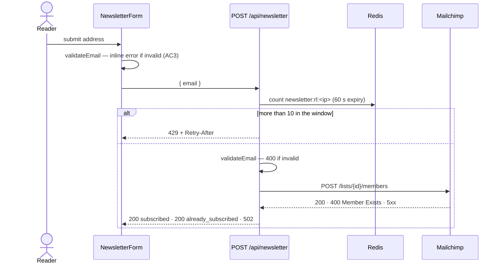

# Plan: Newsletter signup on article pages

- **Spec:** ./spec.md · **Tasks:** ./tasks.md
- **Last updated:** 2026-06-09

## Constitution check

Every principle in `docs/CONSTITUTION.md` was read against this plan (2026-06-08).

- [x] No conflicts — or each conflict is listed below with its resolution
- [x] Security by default — the endpoint is public by design (a signup form) and is validated and
      rate-limited; spec § Security says so
- [x] Secrets — the Mailchimp key is read only in server-only code; both variable names are
      declared in `.env.example`
- [x] Requirements not invented — every AC traces to MKT-412 or to spec § Clarifications
- [x] No new dependency — Mailchimp is called with `fetch`; `server-only` is already installed
- [x] Approved stack — Next.js, Contentful, Mailchimp (ADR-0007), Redis (ADR-0009); nothing new
- [x] Accessibility — WCAG 2.1 AA; the `jsx-a11y` lint rules stay on
- [x] Types not silenced
- [x] No migrations in this change

## Approach

The form posts to a new same-origin Route Handler, `POST /api/newsletter`, which checks a per-IP
rate limit, validates the address, and adds it to the Mailchimp audience with one `fetch` call.
The copy comes from a new Contentful entry, read on the server when an article page renders. When
the entry can't be loaded or is incomplete, the section renders nothing (AC5) — which also makes
publishing the entry the switch that turns the form on (see Rollout). Validation is one function,
shared by the form (instant feedback, AC3) and the endpoint (the source of truth, spec § Security).

Rate-limit counters live in the shared Redis store (ADR-0009) under their own key prefix, with a
60-second expiry — the retention limit in spec § Privacy.

The copy is fetched with the article route's existing 300-second revalidation window. Next.js
regenerates a statically rendered page at the shortest interval among the data it fetches, so a
shorter window here would make every article page regenerate more often. Five minutes meets the
business criterion. (The draft plan used 60 seconds; `@spec-analyzer` caught the side effect.)

Rejected:

- Mailchimp's embedded signup form — a third-party script, with no control over copy or
  accessibility.
- Mailchimp's SDK — one endpoint doesn't justify a dependency.
- A Server Action instead of a Route Handler — the 429 needs a status code and a `Retry-After`
  header; a route gives the form, the tests, and the runbook one plain HTTP contract.
- Rate limiting in `middleware.ts` — middleware runs on every request on the site.
- An in-memory rate limit — serverless instances don't share memory.
- On-demand revalidation through a Contentful webhook — not needed for a 5-minute target; it would
  add an endpoint and a secret.

## Architecture & integrations

- **Signup copy** — the six fields of the `newsletterSignup` entry. `lib/contentful/newsletter.ts`
  owns loading it and deciding whether it is complete; components never inspect fields.
- **Signup request and outcome** — an address in; `subscribed`, `already_subscribed`,
  `invalid_email`, `rate_limited`, or `provider_unavailable` out. `lib/newsletter/` owns
  validation, rate limiting, and the Mailchimp call, with no Next.js imports, so each piece is
  testable alone. `app/api/newsletter/route.ts` composes them and maps outcomes to HTTP.
- **UI** — `components/NewsletterSignup.tsx` (server component) loads the copy and renders nothing
  when it is `null`; `components/NewsletterForm.client.tsx` (client component) owns the form state
  and calls the endpoint.
- **Must not leak:** the Mailchimp key and Mailchimp's response shapes stay inside
  `lib/newsletter/mailchimp.ts`, which imports `server-only`, so a client import fails the build.
  The form knows only the endpoint's JSON. Copy is rendered as text.
- **Mailchimp** — Marketing API v3, `POST /lists/{list_id}/members` with `status: "subscribed"`,
  called from the endpoint only. Credentials: `MAILCHIMP_API_KEY` (its suffix names the data center,
  which picks the host) and `MAILCHIMP_LIST_ID`. A 400 titled "Member Exists" means the address is
  already on the list; any other error response, or a network failure, raises
  `MailchimpUnavailableError`, and the reader sees the error message (AC6).
- **Contentful** — the GraphQL Content API, through the existing `lib/contentful/client.ts` and its
  token.
- **Redis** — the existing `lib/redis.ts` client.

## Change surface

Verified by reading the article route, the Contentful and Redis clients, the contact form's
endpoint (the closest existing pattern, `app/api/contact/route.ts`), and the test setup in
`tests/`.

| Area / layer | File (new / changed) | Why |
| --- | --- | --- |
| Validation | `lib/newsletter/validate-email.ts` (new) | AC3, Security — shared by the form and the endpoint |
| Rate limiting | `lib/newsletter/rate-limit.ts` (new) | Security (10/IP/minute), Privacy (60-second expiry) |
| Email provider | `lib/newsletter/mailchimp.ts` (new) | AC2, AC4, AC6 — the only code that calls Mailchimp |
| CMS | `lib/contentful/newsletter.ts` (new) | AC1, AC5 — loads the entry; `null` when unavailable or incomplete |
| API | `app/api/newsletter/route.ts` (new) | AC2–AC4, AC6, Security |
| UI | `components/NewsletterSignup.tsx` (new) | AC1, AC5 — server component |
| UI | `components/NewsletterForm.client.tsx` (new) | AC2–AC4, AC6, Accessibility |
| Pages | `app/articles/[slug]/page.tsx` (changed — shared) | AC1 — renders the section below the article body |
| Config | `.env.example` (changed — shared) | Declares `MAILCHIMP_API_KEY` and `MAILCHIMP_LIST_ID` |
| Tests | `lib/newsletter/__tests__/validate-email.test.ts`, `rate-limit.test.ts`, `mailchimp.test.ts`; `lib/contentful/__tests__/newsletter.test.ts`; `app/api/newsletter/__tests__/route.test.ts`; `components/__tests__/NewsletterSignup.test.tsx`, `NewsletterForm.test.tsx`; `e2e/newsletter-signup.spec.ts` (all new) | Test strategy |
| Test fixtures | `tests/fixtures/contentful/newsletter-signup.json`, `tests/msw/mailchimp.ts` (new); `tests/msw/handlers.ts` (changed — shared) | The Contentful entry and Mailchimp's responses, for unit and end-to-end tests |
| Docs | `docs/admin/newsletter.md`, `docs/copy/newsletter-defaults.md` (new, pre); `docs/runbooks/newsletter.md` (new, post) | Documentation plan |

**Shared code and its other consumers:**

- `app/articles/[slug]/page.tsx` renders every article (about 1,300 URLs) and is statically
  generated with `export const revalidate = 300`. The copy fetch uses the same 300 seconds, so the
  page's regeneration interval doesn't change; adding the section is the only change to the page.
- `.env.example` — read by every developer's setup and by CI; two names added, nothing changed.
- `tests/msw/handlers.ts` — loaded by every test that uses MSW; the new handlers match only
  Mailchimp's host.
- Used, not changed: `lib/contentful/client.ts` (articles, authors, navigation), `lib/redis.ts`
  (the contact form's spam check), `tests/fakes/redis.ts`.

**Not touched (deliberately):**

- `lib/contentful/client.ts` — works as is; changing it would touch every Contentful read on the
  site.
- The contact form and its spam check — same Redis store, separate keys (`newsletter:rl:*`).
  Merging both into one shared limiter wasn't asked for and would change the contact form.
- `middleware.ts` — rate limiting stays in the endpoint.
- `docs/ARCHITECTURE.md` — dropped at the gate: it describes cross-cutting structure, not single
  features.

## Data model & contracts

**Contentful — new content type `newsletterSignup`.** One entry. Created in the Contentful web app
by marketing ops — nothing in this repository creates content types.

| Field | Type | Required | Max length | Shown as |
| --- | --- | --- | --- | --- |
| `title` | Short text | Yes | 80 | Section heading |
| `body` | Long text | Yes | 200 | Text under the heading |
| `ctaLabel` | Short text | Yes | 30 | Button label |
| `successMessage` | Long text | Yes | 200 | Replaces the form after a signup |
| `alreadySubscribedMessage` | Long text | Yes | 200 | Replaces the form when the address is already on the list |
| `errorMessage` | Long text | Yes | 200 | Under the form when Mailchimp fails or the reader is rate-limited |

**Endpoint — `POST /api/newsletter`.** Called only by the form, on the same origin, so its contract
lives here rather than in `contracts/`.

| Request | Responses |
| --- | --- |
| `{ "email": string }` | `200 { "status": "subscribed" }` · `200 { "status": "already_subscribed" }` · `400 { "error": "invalid_email" }` · `429 { "error": "rate_limited" }` with `Retry-After` · `502 { "error": "provider_unavailable" }` |

**Environment variables:** `MAILCHIMP_API_KEY` and `MAILCHIMP_LIST_ID` — new, declared by name in
`.env.example`, set in Vercel for Development, Preview, and Production. The Contentful and Redis
variables are unchanged.

**Redis:** one counter per IP, key `newsletter:rl:<ip>`, expiring 60 seconds after the first
request in the window.

**Database:** none — no migrations.

## Test strategy

Vitest for unit, integration, and component tests; Playwright on port 3001 for end-to-end tests,
against the project's existing mock layer — Contentful entries from `tests/fixtures/contentful/`,
Mailchimp through the MSW handlers in `tests/msw/`, Redis through the in-memory fake in
`tests/fakes/redis.ts`. The endpoint's tests mock `lib/newsletter/mailchimp.ts` at the module
boundary; the Mailchimp client's own tests mock HTTP.

| Requirement | Test (file · name) | Type |
| --- | --- | --- |
| AC1 | `lib/contentful/__tests__/newsletter.test.ts` · "maps the published entry to the six copy fields" | unit |
| AC1 | `components/__tests__/NewsletterSignup.test.tsx` · "renders the section with the copy from Contentful" | component |
| AC1 | `e2e/newsletter-signup.spec.ts` · "shows the signup section with Contentful copy below the article body" | e2e |
| AC2 | `lib/newsletter/__tests__/mailchimp.test.ts` · "subscribes a new address" | unit |
| AC2 | `app/api/newsletter/__tests__/route.test.ts` · "subscribes a valid email and returns 200 subscribed" | integration |
| AC2 | `components/__tests__/NewsletterForm.test.tsx` · "replaces the form with the success message after a successful signup" | component |
| AC2 | `e2e/newsletter-signup.spec.ts` · "a reader subscribes and sees the success message" | e2e |
| AC3 | `lib/newsletter/__tests__/validate-email.test.ts` · "rejects an empty or whitespace-only value as empty", "rejects %s as invalid", "rejects an address longer than 254 characters as invalid" | unit |
| AC3 | `route.test.ts` · "returns 400 invalid_email for %s" (missing, malformed, non-string, over 254 characters) | integration |
| AC3 | `NewsletterForm.test.tsx` · "shows an inline error, sends nothing, and moves focus to the field for an invalid email" | component |
| AC3 | `newsletter-signup.spec.ts` · "an invalid email shows an inline error and nothing is sent" | e2e |
| AC4 | `mailchimp.test.ts` · "maps Mailchimp's Member Exists response to already_subscribed" | unit |
| AC4 | `route.test.ts` · "returns 200 already_subscribed for an address already on the list" | integration |
| AC4 | `NewsletterForm.test.tsx` · "shows the already-subscribed message, not the success message" | component |
| AC4 | `newsletter-signup.spec.ts` · "an address already on the list sees the already-subscribed message" | e2e |
| AC5 | `newsletter.test.ts` · "returns null when no entry is published", "returns null when a required field is empty", "returns null when Contentful is unreachable" | unit |
| AC5 | `NewsletterSignup.test.tsx` · "renders nothing when the copy can't be loaded" | component |
| AC5 | `newsletter-signup.spec.ts` · "renders the article without the section when Contentful fails" | e2e |
| AC6 | `mailchimp.test.ts` · "throws MailchimpUnavailableError on a 5xx response", "throws MailchimpUnavailableError on a network failure" | unit |
| AC6 | `route.test.ts` · "returns 502 provider_unavailable and logs newsletter.subscribe.mailchimp_error when Mailchimp fails" | integration |
| AC6 | `NewsletterForm.test.tsx` · "shows the error message and keeps the typed email after a provider failure" | component |
| AC6 | `newsletter-signup.spec.ts` · "a provider failure keeps the email and allows a retry" | e2e |
| Edge: spaces and capitals | `validate-email.test.ts` · "accepts and normalizes a valid address" | unit |
| Edge: repeated clicks | `NewsletterForm.test.tsx` · "disables the button and keeps its accessible name while a request is in flight" | component |
| Edge: over the rate limit | `NewsletterForm.test.tsx` · "shows the error message when rate-limited" | component |
| Business: copy live within 5 minutes; article regeneration unchanged | `newsletter.test.ts` · "requests the entry with the article route's 300-second revalidation" | unit |
| Security: key stays on the server | `pnpm build` fails if a client component imports `lib/newsletter/mailchimp.ts` (`server-only`) | build |
| Security: 10 requests/IP/minute, 429 with `Retry-After` | `rate-limit.test.ts` · "allows 10 requests from one IP and blocks the 11th with retryAfter", "counts each IP separately"; `route.test.ts` · "returns 429 with Retry-After on the 11th request from one IP" | unit, integration |
| Security: server-side validation, crafted requests | `route.test.ts` · "returns 400 invalid_email for %s"; `validate-email.test.ts` · "rejects a non-string value as invalid" | integration, unit |
| Security: copy rendered as text | the `react/no-danger` lint rule; checked in review | lint |
| Privacy: IP kept at most 60 seconds | `rate-limit.test.ts` · "stores the per-IP counter with a 60-second expiry" | unit |
| Privacy: no cookies | `newsletter-signup.spec.ts` · "sets no cookies when subscribing" | e2e |
| Accessibility: visible, associated label | `NewsletterForm.test.tsx` · "labels the email field" | component |
| Accessibility: `role="alert"` and focus | covered by AC3's component test | component |
| Accessibility: `role="status"` | `NewsletterForm.test.tsx` · "announces success and already-subscribed messages with role=status" | component |
| Accessibility: accessible name while pending | covered by the repeated-clicks test | component |
| Accessibility: keyboard order | `newsletter-signup.spec.ts` · "reaches the field and the button in order with the keyboard" | e2e |
| Accessibility: 44×44 px targets | `newsletter-signup.spec.ts` · "field and button are at least 44×44 px on a 375 px viewport" | e2e |
| Testing: axe scan | `newsletter-signup.spec.ts` · "has no axe violations with the form rendered" | e2e |
| Testing: screen reader | VoiceOver pass on the preview deployment, before the pull request is marked ready — needs a person | manual |

**Contract-first acceptance tests:** none. The end-to-end acceptance tests are Phase 4, after the
stories.

## Documentation plan

| Doc | Audience | Pre / post | Task |
| --- | --- | --- | --- |
| `docs/admin/newsletter.md` | Site administrators (marketing) | pre | T001 |
| `docs/copy/newsletter-defaults.md` | Marketing (copy) | pre | T002 |
| `docs/runbooks/newsletter.md` | Operators / on-call | post | T041 |

## Rollout & deployment

1. Marketing ops creates the `newsletterSignup` content type in the Contentful `sandbox`
   environment, then in `master`, from the field table above (also in the admin guide). Preview
   deployments read `sandbox`.
2. Set `MAILCHIMP_API_KEY` and `MAILCHIMP_LIST_ID` in Vercel for Development, Preview, and
   Production. Preview matters: without them, every signup on the preview answers 502.
3. Merge and deploy whenever ready. No entry is published in `master`, so production shows no
   section (AC5).
4. After the deploy, Sam creates the entry in `master` as a draft, with the text from
   `docs/copy/newsletter-defaults.md`.
5. Marketing reviews the draft and publishes it on 2026-06-22. The section appears within 5
   minutes.

**Rollback:** unpublish the entry — the section disappears within 5 minutes, with no deploy. Or
revert the deploy. Nothing to undo in data: subscribers stay in Mailchimp.

## Risks & mitigations

- The "already subscribed" message tells anyone whether an address is on the list — accepted by the
  security lead (spec § Clarifications); the rate limit bounds lookups.
- `x-forwarded-for` can be trusted only because Vercel overwrites it (A1). If the site moves behind
  another proxy, the rate limit becomes spoofable — a one-line comment where the header is read,
  and the runbook, say so.
- A fixed window lets one IP send up to 20 requests across a window boundary — acceptable at this
  scale.
- Rotating IP addresses gets around a per-IP limit — accepted; Mailchimp ignores duplicate
  addresses, so the worst case is noise in the logs.

## Assumptions

- A1 — Vercel overwrites `x-forwarded-for` with the address of the client that connected, so its
  first entry is the reader's IP. (Vercel's documentation; the contact form's spam check already
  relies on it. Confirmed by Sam at the gate.)
- A2 — The Mailchimp audience is single opt-in, so the API accepts `status: "subscribed"` directly.
  (Dana — spec § Clarifications.)
- A3 — Marketing ops creates content types in the Contentful web app; nothing in this repository
  creates them. (Sam.)
- A4 — The code deploys before the entry is published; marketing publishes it on campaign day, and
  AC5 keeps the section hidden until then. (Corrected at the gate — the draft assumed marketing
  would publish first. Dana, relayed by Sam, 2026-06-09.)
- A5 — The article route keeps `revalidate = 300`. If someone shortens it, copy edits show up
  sooner; nothing breaks.

## Open questions

None — every question raised while planning is answered in spec.md § Clarifications.
